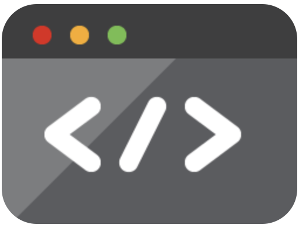

  
  

  

  

## @mytchallb

Hi I'm Mytch, a full-stack developer based in Christchurch, New Zealand.  

I'm passionate about building web and mobile apps, game dev, blockchain, and keeping up to date with the latest tech.  
Connect with me on [LinkedIn](https://www.linkedin.com/in/mytchall-bransgrove/), [Twitter](https://twitter.com/mytchallb), or visit my [Blog](https://mytchall.dev/)!
 
🏙 See my [contribution city](https://honzaap.github.io/GithubCity/?name=mytchallb&year=2024)

---

---

### 📝 My Blog

* [⚡️ Speed up development with terminal shortcuts](https://mytchall.dev/speed-up-development-with-terminal-shortcuts/)
* [🎛️ How to use .env files with WordPress for easy deployments](https://mytchall.dev/how-to-use-env-files-with-wordpress-for-easy-deployments/)
* [💯 Using decimals and percentages in Solidity](https://mytchall.dev/using-decimals-and-percentages-in-solidity/)
* [Ⓢ Upgrade your Statamic project from Webpack to Vite with Tailwind](https://mytchall.dev/upgrade-your-statamic-project-from-webpack-to-vite-with-tailwind/)
* [🔧 Optimising GameMaker Studio 2.3 for HTML5 web and mobile games](https://mytchall.dev/optimising-gamemaker-studio-2-3-for-html5-web-and-mobile-games/)
* [🎮 Converting a GameMaker Studio HTML5 game into a Progressive Web App (PWA)](https://mytchall.dev/converting-a-gamemaker-studio-html5-game-into-a-progressive-web-app-pwa/)

---

### 📝 Tools I've Built

**[WP - Simplify Dashboard](https://mytchall.dev/projects/wordpress-simplify-dashboard/)**
A useful WordPress plugin to show/hide unnecessary menus. In the settings page define what you want to hide by menu name or element ID. A toggle is created to easily switch between modes.

---

### 💾 Work

**hairyLemon**  
_Apr 2023 - Current | PHP, Laravel, Vue, Docker_  
I've developed several custom Laravel apps with Vue/Tailwind on the front-end, built a React Native app for iOS and Android and written themes for a variety of client websites on CMS platforms like Statamic, Shopify and WordPress.

**Oddworx**  
_Nov 2021 - Nov 2022 | JS, TS, Node, GML, Solidity, Docker_  
Wrote an ERC20 and [Staking contract](https://etherscan.io/address/0x428b6a13277116C62D751bebbC6f47011A0Cdc11#code) in Solidity to interact with a NFT set with unit testing through Hardhat, helped build an accompanying [dApp](https://app.oddworx.com/) with Tailwind, Vite and Next.JS/Redwood.js. Part of the project included implementing Shopify’s Storefront API where users could spend their ERC20 token in return for physical products. 
Created [two HTML5 games](https://app.oddworx.com/arcade) with Game Maker Studio and associated API's in Node.

**Artikel & Swint**  
_Dec 2017 - Sep 2021 | JS, PHP, mySQL, SASS_  
For an advertising agency built over 30 websites with Wordpress, Shopify and other CMS's, managed a Linux VPS with Plesk along with DNS and email. [One project](https://nzpetfoods.co.nz/pages/freight) included a custom PHP-based shipping solution built in Shopify.

**Ministry Maps**  
_Jan 2018 - Feb 2020 | PHP, mySQL, JS, GML, SASS_  
Built a PHP/JS based freemium [web app](https://ministrymaps.co.nz/) (without frameworks) and accompanying iOS and Android mobile apps to handle user-generated content like images and metadata. I added features including: Paypal IPN payments, user signup/authentication data sanitizing, an API and  role-based account sharing through raw SQL queries.

---

### 🎮 Game dev

**[Melon Mash - Fruity Fun](https://apps.mbmedia.co.nz/melon-mash/)**  
A tetris-inspired puzzle game built with GMS, available on iOS, Android and HTML5

**[Wordle](https://github.com/mytchallb/wordle)**  
A simple JS version of the popular game built with Vite, available on HTML5

**[Chunkie Run](https://arcade.oddworx.com/chunkie-run/)**  
An endless runner built with GMS & a Node API requiring a web3 signed message for user authentication, available on HTML5 and installable as a PWA with offline score support

**[Genzee Grab](https://arcade.oddworx.com/genzee-grab/)**  
An arcade machine game built with GMS & a Node API requiring a web3 signed message for user authentication, available on HTML5

[**Shyguy**](?)  
TBA

[**Bombz Away**](?)  
TBA

---

### Freelance Work

**[MediaHost.nz](https://mediahost.nz)**  
My self-employed contracting work. Currently working on a simple CMS.
